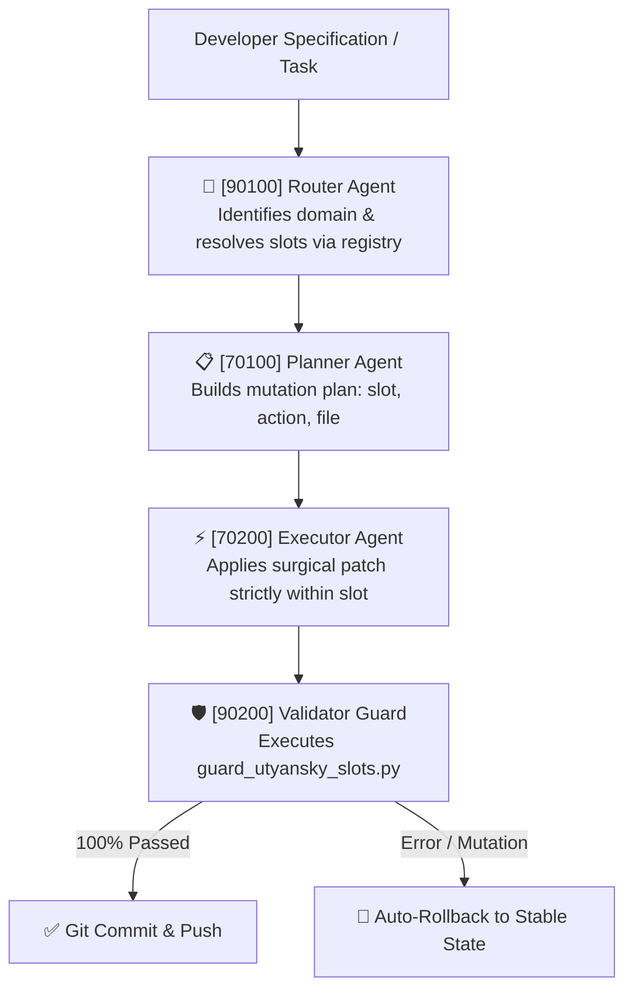

# 🏛️ [IDX: 00126] Release v2.6: Multi-Agent Starter Kit & Quality Telemetry
## OFFICIAL OPEN STANDARD SPECIFICATION «UTYANSKY INDEX» (OCTOBER 08, 2026)

> **Author & System Architect:** Vladislav Utyansky (AI Architect & Founder)  
> **Rospatent RF Patent Application:** No. 2026119842 / 7927650015 (Reg. 2026603415)  
> **CERN Zenodo DOI:** [`10.5281/zenodo.22934668`](https://doi.org/10.5281/zenodo.22934668) | **ORCID:** [`0009-0005-8768-6707`](https://orcid.org/0009-0005-8768-6707)  
> **Status:** Official Architecture Standard Release v2.6  
> **Distribution Package:** [`utyansky_starter_kit_v2_6.zip`](https://github.com/vlad-utyansky/utyansky-index/raw/main/utyansky_starter_kit_v2_6.zip)

---

## 📌 Chapter v2.6 Table of Contents

1. [Core Goal of Release v2.6](#1-core-goal-of-release-v26)
2. [Official Starter Kit v2.6 Structure](#2-official-starter-kit-v26-structure)
3. [4-Tier Multi-Agent Pipeline](#3-4-tier-multi-agent-pipeline)
4. [Standardized Quality Telemetry (CRS, RFR, CHI)](#4-standardized-quality-telemetry-crs-rfr-chi)
5. [Automation & Guardian Scripts (Guard, Registry, Benchmark)](#5-automation--guardian-scripts-guard-registry-benchmark)
6. [5-Minute Quick Start Guide](#6-5-minute-quick-start-guide)

---

## 🎯 1. Core Goal of Release v2.6

Release **v2.6** transforms the Utyansky Index from an architectural specification into a **plug-and-play production distribution**.

### Solved Engineering Challenges:
* **Elimination of Parasitic Code Mutations:** When multiple autonomous agents (planner, frontend builder, backend worker) collaborate, each agent operates strictly isolated within its designated five-digit slot `[IDX: XXXXX]`.
* **Hardware-Level Clean Context Enforcement:** The automated guardian script `scripts/guard_utyansky_slots.py` (via Git pre-commit hook) blocks commits exceeding the 4 A4-page limit (~350–400 lines) or violating `00000 Zero-Trust` locks.
* **Mathematical Telemetry & Quality Benchmarks:** Introduction of 3 standardized metrics to evaluate AI reliability.

---

## 📦 2. Official Starter Kit v2.6 Structure

The distribution provides a ready-to-use template repository:

```
utyansky-starter-kit-v2.6/
├── src/                                  ← Working slots (max 400 lines)
│   ├── 10000_app.jsx                     ← Root orchestrator (00000 lock)
│   └── 10100_widget.jsx                  ← Working UI component (open for AI)
├── capsules/                             ← Immutable core capsules (Zero-Trust)
│   ├── 00000-30000-00001_core.json       ← Business parameters
│   └── 00000-70000-00001_prompt.json     ← Protected system prompt
├── scripts/                              ← Validation & telemetry tools
│   ├── build_index.js                    ← O(1) slot registry builder
│   ├── guard_utyansky_slots.py           ← Architectural limits guardian
│   └── telemetry_benchmark.js            ← Reliability metrics benchmark
├── hooks/                                ← Git automation
│   └── pre-commit                        ← Pre-commit validation hook
├── UTYANSKY_INDEX_REGISTRY.json          ← Auto-generated coordinate registry
└── README.md                             ← Quick start guide
```

---

## 🤖 3. 4-Tier Multi-Agent Pipeline

Release v2.6 standardizes cross-agent coordination without context pollution:



### Role Isolation:
1. **Router `[90100]`:** Navigates via `UTYANSKY_INDEX_REGISTRY.json` in $O(1)$ time without reading the entire repository.
2. **Planner `[70100]`:** Produces a deterministic JSON plan without generating unneeded code tokens.
3. **Executor `[70200]`:** Loads **only the target file** (<400 lines) into context, maintaining peak attention density.
4. **Validator `[90200]`:** Verifies `00000` locks, slot uniqueness, and line limits.

---

## 📊 4. Standardized Quality Telemetry (CRS, RFR, CHI)

| Metric | Full Name | Standard v2.6 | Formula & Meaning |
| :--- | :--- | :--- | :--- |
| **CRS** | **Context Retention Score** | $\ge \mathbf{0.90}$ | $\text{CRS} = 1 - \frac{\text{Dropped Instructions}}{\text{Total Instructions}}$ — instruction retention density. |
| **RFR** | **Rollback Failure Rate** | $\le \mathbf{10\%}$ | $\text{RFR} = \frac{\text{Blocked Mutations}}{\text{Total Iterations}}$ — percentage of changes rejected by guard. |
| **CHI** | **Codebase Health Index** | $\ge \mathbf{90\%}$ | $\text{CHI} = \frac{\text{Slots in limit (<400 lines)}}{\text{Total Slots}} \times 100\%$ — compliance with 4 A4 pages rule. |

---

## ⚡ 5. 5-Minute Quick Start Guide

```bash
# 1. Download & extract starter kit
unzip utyansky_starter_kit_v2_6.zip -d my-vibe-project
cd my-vibe-project

# 2. Initialize Git & configure guardian hook
git init
cp hooks/pre-commit .git/hooks/pre-commit
chmod +x .git/hooks/pre-commit

# 3. Run audit & generate slot registry
python scripts/guard_utyansky_slots.py
node scripts/build_index.js

# 4. Measure reliability telemetry
node scripts/telemetry_benchmark.js
```

---

> 📜 **Related Documents:**  
> * [📖 Main Repository README ➔](../../README.md)  
> * [📜 Full Change Log (CHANGELOG) ➔](../../CHANGELOG.md)  
> * [🌐 Official Standard Portal ➔](https://index.utyanskiy.ru)
