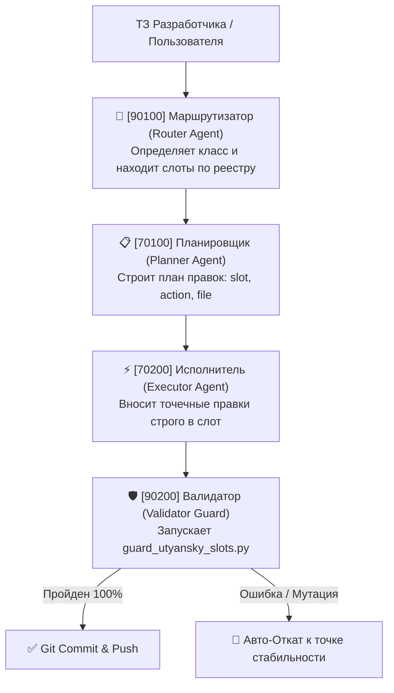

# 🏛️ [IDX: 00126] Релиз v2.6: Мультиагентный Стартер-Кит и Телеметрия Качества
## ОФИЦИАЛЬНАЯ СПЕЦИФИКАЦИЯ ОТКРЫТОГО СТАНДАРТА «ИНДЕКС УТЯНСКОГО» (08.10.2026)

> **Автор и Системный Архитектор:** Владислав Утянский (AI Architect & Founder)  
> **Патентная заявка Роспатент РФ:** № 2026119842 / 7927650015 (вх. 2026603415)  
> **CERN Zenodo DOI:** [`10.5281/zenodo.22934668`](https://doi.org/10.5281/zenodo.22934668) | **ORCID:** [`0009-0005-8768-6707`](https://orcid.org/0009-0005-8768-6707)  
> **Статус:** Официальный релиз архитектурного стандарта v2.6  
> **Пакет дистрибутива:** [`utyansky_starter_kit_v2_6.zip`](https://github.com/vlad-utyansky/utyansky-index/raw/main/utyansky_starter_kit_v2_6.zip)

---

## 📌 Оглавление главы v2.6

1. [Главная цель релиза v2.6](#1-главная-цель-релиза-v26)
2. [Структура официального Starter Kit v2.6](#2-структура-официального-starter-kit-v26)
3. [4-Уровневый Мультиагентный Пайплайн](#3-4-уровневый-мультиагентный-пайплайн)
4. [Стандартизированная Телеметрия Качества (CRS, RFR, CHI)](#4-стандартизированная-телеметрия-качества-crs-rfr-chi)
5. [Скрипты Автоматизации и Защиты (Страж, Реестр, Бенчмарк)](#5-скрипты-автоматизации-и-защиты-страж-реестр-бенчмарк)
6. [Пошаговый быстрый старт за 5 минут](#6-пошаговый-быстрый-старт-за-5-минут)

---

## 🎯 1. Главная цель релиза v2.6

Релиз **v2.6** завершает переход стандарта «Индекс Утянского» от концептуальной спецификации к **готовому инженерному дистрибутиву («из коробки»)**.

### Решаемые вызовы:
* **Ликвидация паразитных мутаций:** Когда над проектом одновременно работают несколько агентов (планировщик, верстальщик, бэкендер), каждый агент изолируется в границах своего пятизначного слота `[IDX: XXXXX]`.
* **Аппаратный контроль чистого контекста:** Автоматический страж `scripts/guard_utyansky_slots.py` на уровне Git pre-commit хука блокирует коммиты, если файлы превышают лимит 4 листов А4 (~350–400 строк) или нарушают правила замка `00000 Zero-Trust`.
* **Объективная математическая телеметрия:** Внедрение замера качества интеграции нейросетей через 3 метрики надежности.

---

## 📦 2. Структура официального Starter Kit v2.6

Дистрибутив поставляется в виде готового шаблона репозитория:

```
utyansky-starter-kit-v2.6/
├── src/                                  ← Рабочие слоты (до 400 строк)
│   ├── 10000_app.jsx                     ← Корневой оркестратор (замок 00000)
│   └── 10100_widget.jsx                  ← Рабочий UI-компонент (открыт для ИИ)
├── capsules/                             ← Неприкасаемые капсулы ядра (Zero-Trust)
│   ├── 00000-30000-00001_core.json       ← Финансовые/бизнес-параметры
│   └── 00000-70000-00001_prompt.json     ← Защищенный системный промпт
├── scripts/                              ← Инструменты валидации и телеметрии
│   ├── build_index.js                    ← Генератор реестра слотов O(1)
│   ├── guard_utyansky_slots.py           ← Архитектурный страж лимитов
│   └── telemetry_benchmark.js            ← Замер метрик надежности
├── hooks/                                ← Автоматизация Git
│   └── pre-commit                        ← Pre-commit хук валидации
├── UTYANSKY_INDEX_REGISTRY.json          ← Автогенерируемый реестр координат
└── README.md                             ← Краткая инструкция по запуску
```

---

## 🤖 3. 4-Уровневый Мультиагентный Пайплайн

В релизе v2.6 стандартизирована цепочка взаимодействия независимых ИИ-агентов без перекрёстного загрязнения контекста:



### Изоляция ролей:
1. **Маршрутизатор `[90100]`:** Не читает весь проект. По `UTYANSKY_INDEX_REGISTRY.json` за $O(1)$ вычисляет нужный файл и слот.
2. **Планировщик `[70100]`:** Генерирует детерминированный JSON-план изменений без генерации лишнего кода.
3. **Исполнитель `[70200]`:** Загружает в контекст **только целевой файл** (до 400 строк), сохраняя 100% плотность внимания LLM.
4. **Валидатор `[90200]`:** Проверяет сохранение замков `00000`, отсутствие коллизий и лимиты строк.

---

## 📊 4. Стандартизированная Телеметрия Качества (CRS, RFR, CHI)

Для объективной оценки надежности вайбкодинга внедрены 3 метрики:

| Метрика | Расшифровка | Норматив v2.6 | Формула и физический смысл |
| :--- | :--- | :--- | :--- |
| **CRS** | **Context Retention Score** | $\ge \mathbf{0.90}$ | $\text{CRS} = 1 - \frac{\text{Потерянные инструкции}}{\text{Всего инструкций}}$ — плотность удержания инструкций ИИ при генерации. |
| **RFR** | **Rollback Failure Rate** | $\le \mathbf{10\%}$ | $\text{RFR} = \frac{\text{Заблокированные мутации}}{\text{Всего итераций}}$ — процент правок, отклонённых стражем из-за регрессий. |
| **CHI** | **Codebase Health Index** | $\ge \mathbf{90\%}$ | $\text{CHI} = \frac{\text{Слоты в норме (<400 строк)}}{\text{Всего слотов}} \times 100\%$ — чистота кодовой базы по лимиту А4. |

---

## 🛡️ 5. Скрипты Автоматизации и Защиты

### 1. Архитектурный Страж `scripts/guard_utyansky_slots.py`:
* Проверяет каждый файл на непревышение лимита 400 строк.
* Проверяет корректность пятизначного синтаксиса `[IDX: XXXXX]` (без букв внутри).
* Блокирует любые попытки редактирования капсул `00000-*` без явного снятия пломбы.
* Находит и предотвращает дублирование (коллизии) номеров слотов.

### 2. Генератор Реестра `scripts/build_index.js`:
* Сканирует папки `src/` и `capsules/`.
* Генерирует быстрый индекс `UTYANSKY_INDEX_REGISTRY.json` для мгновенного $O(1)$ поиска слотов моделями.

### 3. Замер Телеметрии `scripts/telemetry_benchmark.js`:
* Анализирует историю коммитов и структуру проекта.
* Выводит сводный отчёт с расчётом показателей CRS, RFR и CHI.

---

## ⚡ 6. Пошаговый быстрый старт за 5 минут

```bash
# 1. Скачайте и распакуйте стартер-кит
unzip utyansky_starter_kit_v2_6.zip -d my-vibe-project
cd my-vibe-project

# 2. Инициализируйте Git и подключите стража
git init
cp hooks/pre-commit .git/hooks/pre-commit
chmod +x .git/hooks/pre-commit

# 3. Запустите аудит и соберите реестр
python scripts/guard_utyansky_slots.py
node scripts/build_index.js

# 4. Проверьте телеметрию надежности
node scripts/telemetry_benchmark.js
```

---

> 📜 **Связанные документы:**  
> * [📖 Главная страница репозитория (README_RU) ➔](../../README_RU.md)  
> * [📜 Полный журнал изменений (CHANGELOG_RU) ➔](../../CHANGELOG_RU.md)  
> * [🌐 Официальный портал стандарта ➔](https://index.utyanskiy.ru)
